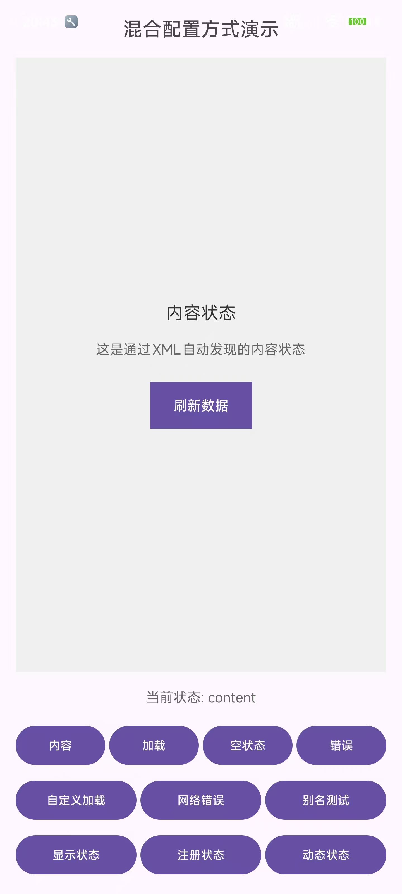

# MultiStatusView

一个轻量级、可灵活扩展的Android多状态视图管理库，支持多种配置模式，轻松实现内容加载、空数据、错误等状态切换。

## 功能特点

- **无限状态**：无预定义状态，开发者可以根据需要自定义任何状态
- **三种配置模式**：XML约定名称、资源ID、布局资源，适应不同开发场景
- **简单自定义容器**：采用MultiStatusHelper + 委托模式，核心逻辑与容器解耦
- **高度可扩展**：可基于任意ViewGroup快速实现自定义MultiStatusView
- **零依赖**：仅依赖Android SDK，无第三方库依赖
- **易集成**：支持现有项目无缝集成，最小化代码改动
- **错误处理**：支持状态未找到、视图异常等情况的处理



## 快速开始

### 1. 添加依赖

在您的 `build.gradle` 文件中添加：

```gradle
implementation 'io.github.xesam:android-multistatusview:0.0.1'
```

或者直接引入项目：

```gradle
dependencies {
    implementation project(':MultiStatusView')
}
```

### 2. 基本使用

#### XML约定名称（推荐）

通过 `app:statusIdPrefix` 前缀和状态名称约定，MultiStatusView 会自动查找对应的视图ID。
例如，状态名称为 `content`，则对应的视图ID应为 `@+id/status_content`。

组件默认的前缀为 `status_`，可以通过 `app:statusIdPrefix` 自定义，注意不要遗漏了 `status_` 尾部的 `_`
符号。

```xml

<io.github.xesam.android.status.MultiStatusView android:id="@+id/multiStatusView"
    android:layout_width="match_parent" android:layout_height="match_parent"
    app:defaultStatus="loading" app:statusIdPrefix="status_">

    <!-- 内容状态 -->
    <LinearLayout android:id="@+id/status_content" android:layout_width="match_parent"
        android:layout_height="match_parent">
        <!-- 您的内容布局 -->
    </LinearLayout>

    <!-- 加载状态 -->
    <LinearLayout android:id="@+id/status_loading" android:layout_width="match_parent"
        android:layout_height="match_parent">
        <!-- 您的内容布局 -->
    </LinearLayout>

    <!-- 空数据状态 -->
    <LinearLayout android:id="@+id/status_empty" android:layout_width="match_parent"
        android:layout_height="match_parent">
        <!-- 您的内容布局 -->
    </LinearLayout>

    <!-- 错误状态 -->
    <LinearLayout android:id="@+id/status_error" android:layout_width="match_parent"
        android:layout_height="match_parent">
        <!-- 您的内容布局 -->
    </LinearLayout>

</io.github.xesam.android.status.MultiStatusView>
```

```kotlin
// 在Activity中
val multiStatusView = findViewById<MultiStatusView>(R.id.multiStatusView)

// 切换状态
multiStatusView.setStatus("loading")  // 显示加载状态
multiStatusView.setStatus("content")  // 显示内容状态
```

#### 资源ID方式（页面内已有View）

```kotlin
val multiStatusView = findViewById<MultiStatusView>(R.id.multiStatusView)

// 注册已存在的视图
multiStatusView
    .registerStatusByViewId("content", R.id.contentLayout)
    .registerStatusByViewId("loading", R.id.loadingLayout)
    .registerStatusByViewId("empty", R.id.emptyLayout)
    .registerStatusByViewId("error", R.id.errorLayout)

// 切换状态
multiStatusView.setStatus("loading")
```

#### 布局资源方式（动态加载View）

```kotlin
val multiStatusView = findViewById<MultiStatusView>(R.id.multiStatusView)

// 注册布局资源
multiStatusView
    .registerStatusByLayout("loading", R.layout.layout_loading)
    .registerStatusByLayout("empty", R.layout.layout_empty) { view ->
        // 初始化视图，如设置点击事件
        view.findViewById<Button>(R.id.retryButton).setOnClickListener {
            // 重试逻辑
        }
    }
    .registerStatusByLayout("error", R.layout.layout_error)

// 切换状态
multiStatusView.setStatus("empty")
```

## API参考

### 核心方法

```kotlin
// 状态切换
fun setStatus(status: String): MultiStatusView
fun getCurrentStatus(): String

// 视图注册
fun registerStatus(status: String, view: View): MultiStatusView
fun registerStatusByViewId(status: String, @IdRes viewId: Int): MultiStatusView
fun registerStatusByLayout(status: String, @LayoutRes layoutRes: Int): MultiStatusView

// 监听器
fun addOnStatusChangeListener(listener: (oldStatus: String, newStatus: String) -> Unit): MultiStatusView
fun setOnStatusNotFoundListener(listener: (String) -> Unit): MultiStatusView
```

### XML属性

```xml

<declare-styleable name="MultiStatusView">
    <!-- 状态ID前缀，默认"status_" -->
    <attr name="statusIdPrefix" format="string" />
    <!-- 默认状态，默认"content" -->
    <attr name="defaultStatus" format="string" />
    <!-- 调试模式，默认false -->
    <attr name="debugMode" format="boolean" />
</declare-styleable>
```

## 演示应用

应用包含6个演示页面：

1. **XML内嵌方式演示** - 展示XML直接声明状态子组件
2. **资源ID方式演示** - 展示代码注册已存在视图
3. **布局资源方式演示** - 展示代码注册布局资源
4. **混合配置方式演示** - 展示多种方式混合使用
5. **RelativeLayout版本演示** - 展示基于RelativeLayout的自定义实现
6. **高级功能演示** - 展示监听器、错误处理等高级功能

## 使用示例

### 网络请求场景

```kotlin
private fun loadData() {
    multiStatusView.setStatus("loading")

    viewModel.loadData().observe(this) { result ->
        when (result) {
            is Success -> {
                if (result.data.isEmpty()) {
                    multiStatusView.setStatus("empty")
                } else {
                    multiStatusView.setStatus("content")
                    // 更新UI
                }
            }
            is Error -> {
                multiStatusView.setStatus("error")
            }
        }
    }
}
```

### 状态切换监听

```kotlin
multiStatusView.addOnStatusChangeListener { oldStatus, newStatus ->
    Log.d("MultiStatusView", "状态切换: $oldStatus → $newStatus")
    // 执行相关逻辑，如埋点、动画等
}
```

## 自定义 MultiStatus 容器

### MultiStatusHelper + 委托模式

MultiStatusView采用**委托模式**架构，核心功能由`MultiStatusHelper`实现，与具体视图容器解耦：

```
MultiStatusView (FrameLayout)  ← 委托 →  MultiStatusHelper
     ↑                                              ↑
     └─ 原始实现，保持兼容                        └─ 核心逻辑，容器无关

RelativeMultiStatusView (RelativeLayout) ← 委托 →  MultiStatusHelper
     ↑                                              ↑
     └─ 新实现，展示扩展性                        └─ 复用相同核心逻辑
```

### 基于RelativeLayout的实现（已提供）

```kotlin
// 使用方式与默认版本完全一致
val multiStatusView = findViewById<RelativeMultiStatusView>(R.id.relativeMultiStatusView)
multiStatusView.setStatus("loading")
```

### 自定义任意容器布局

轻松基于任意ViewGroup创建自己的MultiStatusView：

```java
public class MyLinearMultiStatusView extends LinearLayout {
    private MultiStatusHelper helper;

    public MyLinearMultiStatusView(Context context, AttributeSet attrs) {
        super(context, attrs);
        helper = new MultiStatusHelper(this, context, attrs);
    }

    @Override
    protected void onFinishInflate() {
        super.onFinishInflate();
        helper.autoDiscoverChildViews(); // 自动发现子视图
    }

    // 委托所有方法给helper
    public MyLinearMultiStatusView setStatus(String status) {
        helper.setStatus(status);
        return this;
    }

    // ... 其他方法同样委托给helper
}
```

## 高级配置

### 混合使用多种模式

```kotlin
// XML自动发现 + 代码注册
val multiStatusView = findViewById<MultiStatusView>(R.id.multiStatusView)

// 添加额外的自定义状态
multiStatusView.registerStatusByLayout("custom_loading", R.layout.custom_loading)

// 所有状态都可以正常使用
multiStatusView.setStatus("custom_loading")
```

### 状态别名

```kotlin
// 为状态设置别名，便于状态管理和复用
multiStatusView
    .addStatusAlias("network_error", "error")
    .addStatusAlias("server_error", "error")

// 使用别名切换状态
multiStatusView.setStatus("network_error")  // 实际显示error状态
```

## 兼容性

- **最低API级别**：19 (Android 4.4)
- **推荐API级别**：21+ (Android 5.0+)
- **支持AndroidX**：支持

## 状态调试

启用调试模式查看详细日志：

```xml

<io.github.xesam.android.status.MultiStatusView android:id="@+id/multiStatusView"
    android:layout_width="match_parent" android:layout_height="match_parent" app:debugMode="true" />
```

## 📄 许可证

```
Copyright 2024 MultiStatusView

Licensed under the Apache License, Version 2.0 (the "License");
you may not use this file except in compliance with the License.
You may obtain a copy of the License at

    http://www.apache.org/licenses/LICENSE-2.0

Unless required by applicable law or agreed to in writing, software
distributed under the License is distributed on an "AS IS" BASIS,
WITHOUT WARRANTIES OR CONDITIONS OF ANY KIND, either express or implied.
See the License for the specific language governing permissions and
limitations under the License.
```

## 贡献

欢迎提交Issue和Pull Request来改进这个项目！